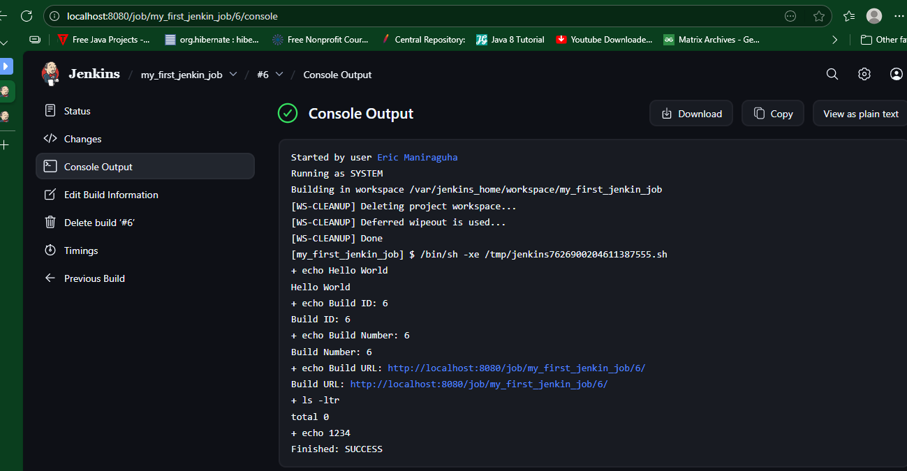

# Jenkins CI/CD Learning Project

## 📌 Project Overview

This repository documents my **hands-on learning journey with Jenkins**, focusing on build configurations, job creation, and CI/CD best practices.
Each section represents a **new configuration or feature** added incrementally, with explanations and screenshots.

---

## 🎯 Project Objectives

* Learn Jenkins fundamentals through practical examples
* Understand CI/CD concepts using real configurations
* Build reproducible and clean Jenkins jobs
* Document each step clearly for future reference and sharing

---

## 🧱 Current Implementation

### 1️⃣ Basic Jenkins Build – Hello World

#### 🔧 Configuration Summary

* Job Type: Freestyle Project
* Build Step: Execute Shell
* Workspace Policy:
  ✅ *Delete workspace before build starts*


> 📸 Screenshots included for job configuration and console output



---

#### 🧪 Build Script Used

```bash
# Print a simple message to confirm the build started
echo "Hello World"

# Display Jenkins build metadata
echo "Build ID: ${BUILD_ID}"
echo "Build Number: ${BUILD_NUMBER}"
echo "Build URL: ${BUILD_URL}"

# List files in the current workspace
ls -ltr

# Create a test file in the workspace
echo "1234" > test.txt
```

---

#### 📈 What This Demonstrates

* Jenkins environment variables
* Clean workspace execution
* File creation during builds
* Console logging and traceability

---

## 🧩 Upcoming Additions (Planned)

> This section will grow as new configurations are added.

* [ ] Archive build artifacts
* [ ] Convert Freestyle job to Jenkins Pipeline
* [ ] GitHub integration (SCM polling & webhooks)
* [ ] Docker image build using Jenkins
* [ ] Jenkins credentials management
* [ ] Parameterized builds
* [ ] Notifications (Email / Slack)
* [ ] Multi-stage CI/CD pipeline

---

## 📂 Screenshots & Evidence

All screenshots are stored in the `/screenshots` directory and referenced in each section to visually support the configuration steps.

---

## 🧠 Key Jenkins Concepts Covered

* Jobs & Builds
* Workspace lifecycle
* Environment variables
* CI logging
* Build reproducibility

---

## 🔁 Continuous Improvement

This project is **iterative by design**.
Each new Jenkins feature or configuration will be:

1. Implemented
2. Documented
3. Illustrated with screenshots
4. Explained clearly in this README

---

## 📌 Notes

* All examples are tested locally using Docker-based Jenkins
* Configuration choices follow CI/CD best practices where applicable

---

