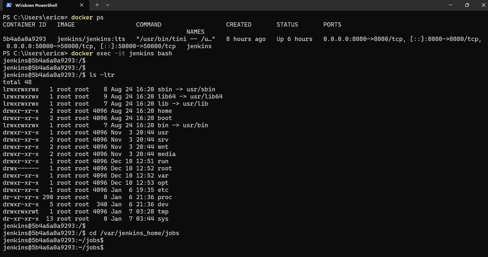

# Jenkins Docker Troubleshooting & File Access Guide

This guide explains **how to inspect Jenkins running in Docker**, check job configurations, view build history, and locate files created by Jenkins builds.

---

## 1️⃣ Verify Jenkins Container Status

Check if your Jenkins container is running:

```powershell
docker ps
```

Example output:

```text
CONTAINER ID   IMAGE                 COMMAND                  CREATED       STATUS       PORTS                                   NAMES
5b4a6a0a9293   jenkins/jenkins:lts   "/usr/bin/tini -- /u…"   8 hours ago   Up 6 hours   0.0.0.0:8080->8080/tcp, 0.0.0.0:50000->50000/tcp   jenkins
```

> 📸 Screenshots included for job accessing jenkins docker image in terminal



---

✅ Confirms Jenkins is **running**
✅ Name of the container is `jenkins`
✅ Web UI accessible at `http://localhost:8080`

---

## 2️⃣ Enter the Jenkins Container

Access the shell of the running container:

```powershell
docker exec -it jenkins bash
```

You will see a prompt:

```text
jenkins@5b4a6a0a9293:/$
```

Now you are **inside the Jenkins container**.

---

## 3️⃣ Explore Jenkins File System

List the root directory:

```bash
ls -ltr
```

Key directories:

* `/var/jenkins_home` → Jenkins home, stores jobs, workspace, plugins
* `/var/jenkins_home/jobs` → Job configurations and build metadata
* `/var/jenkins_home/workspace` → Files created during builds (workspace)

---

## 4️⃣ Access Job Configurations

Navigate to a specific job:

```bash
cd /var/jenkins_home/jobs/my_first_jenkin_job
ls -ltra
```

Example output:

```text
builds/
config.xml
nextBuildNumber
```

**Description of files/folders:**

| Name              | Purpose                                                               |
| ----------------- | --------------------------------------------------------------------- |
| `config.xml`      | Stores Jenkins job configuration (shell commands, triggers, settings) |
| `nextBuildNumber` | Tracks the next build number for this job                             |
| `builds/`         | Contains folders for each past build with logs and metadata           |

---

## 5️⃣ Check Build History

Go inside `builds` to see all builds:

```bash
cd builds
ls
```

Example:

```text
1  2  3  4  5  6  permalinks
```

* Each numbered folder represents a **build execution**
* Contains console logs, artifacts, and metadata

---

## 6️⃣ Access Files Created by Jenkins Build

Files created by a build (e.g., `.txt`) are located in the **workspace**:

```bash
cd /var/jenkins_home/workspace/my_first_jenkin_job
ls -ltra
```

Example output:

```text
test.txt
```

View file contents:

```bash
cat test.txt
```

Output:

```text
1234
```

✅ Confirms the file was successfully created during the Jenkins build.

**Note:** If “Delete workspace before build starts” is enabled, old files are deleted at the start of each new build. Use **Archive Artifacts** to persist files permanently.

---

## 7️⃣ Inspect Job Configuration (Optional)

To see what the job executes:

```bash
cat /var/jenkins_home/jobs/my_first_jenkin_job/config.xml
```

This includes:

```xml
<builders>
  <hudson.tasks.Shell>
    <command>
      # Build commands
      echo "Hello World"
      echo "Build ID: ${BUILD_ID}"
      echo "Build Number: ${BUILD_NUMBER}"
      echo "Build URL: ${BUILD_URL}"
      ls -ltr
      echo "1234" > test.txt
    </command>
  </hudson.tasks.Shell>
</builders>
```

---

## 8️⃣ Summary: Key Jenkins Paths Inside Docker

| Path                                     | Description                                                        |
| ---------------------------------------- | ------------------------------------------------------------------ |
| `/var/jenkins_home`                      | Jenkins home directory                                             |
| `/var/jenkins_home/jobs`                 | Job configurations and metadata                                    |
| `/var/jenkins_home/jobs/<job-name>`      | Individual job folder (`config.xml`, `builds/`, `nextBuildNumber`) |
| `/var/jenkins_home/workspace/<job-name>` | Workspace containing files created during builds                   |

---

## 9️⃣ Best Practices

* Use **workspace cleanup** carefully
* Archive important files as **artifacts**
* Back up `/var/jenkins_home` to preserve jobs and history
* Inspect `config.xml` to understand the job structure

---

## 🔑 Why This Matters

* Ensures you can **troubleshoot Jenkins builds**
* Helps **access job files** like `.txt` or other artifacts
* Essential for **CI/CD debugging** and **DevOps automation**

---

